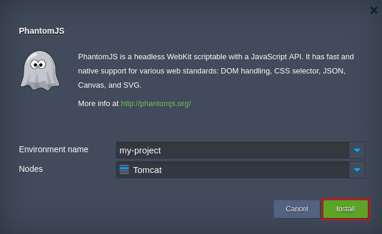

# PhantomJS WebKit Add-On  

[PhantomJS](http://phantomjs.org) is a headless web browser that uses WebKit layout engine and JavaScript API for automating web page interaction and running scripted tests. It provides fast integration and native support for multiple web standards, such as DOM handling, CSS selector, JSON, Canvas, SVG, etc.  

**Key PhantomJS features:**
- headless testing of web applications 
- taking screenshots of web pages 
- monitoring network requests and responses 
- evaluating code

**Type of nodes this add-on can be applied to:** All supported [application servers](https://docs.jelastic.com/software-stacks-versions#app-servers), including [Docker containers](https://docs.jelastic.com/dockers-overview#get-docker) (in the latter case, the appropriate container should be placed within *App Servers* environment layer).

To know more about [Jelastic Add-ons](https://github.com/jelastic-jps/jpswiki/wiki/Jelastic-Addons) and their usage, read through the appropriate reference.

## How to Integrate PhantomJS to Jelastic Environment

For the PhantomJS add-on appliance, copy link to the **_manifest.jps_** file above and [import](https://docs.jelastic.com/environment-import) it through your Jelastic dashboard at the required [platform](https://jelastic.cloud/).

              

In the opened frame, specify the following parameters:
- **Environment name** - target environment with an application the add-on should be integrated to
- **Nodes** - your application server name (is fetched automatically upon selecting the environment)
        
Click **Install** to continue. 

If your application server runs over multiple containers (i.e. being [scaled horizontally](https://docs.jelastic.com/multi-nodes)), the PhantomJS add-on will be integrated to all of them. Once the installation is finished, you can proceed with executing the appropriate JS scripts within your application server container(s) to launch the required testing, monitoring and automation activities for your project.  

For the detailed guidance on further PhantomJS usage, refer to the product [official documentation](http://phantomjs.org/documentation/).
